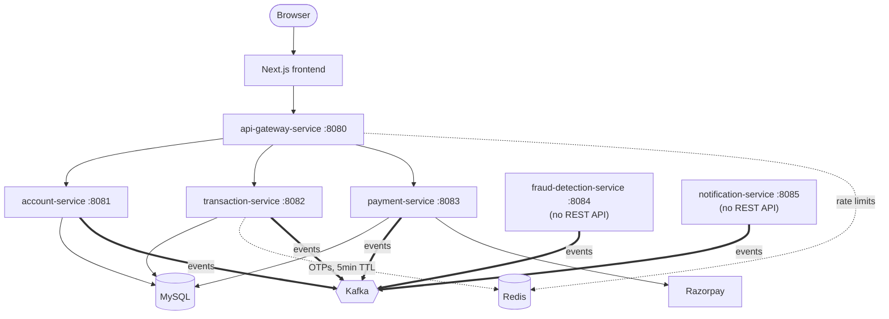

# Coverstone Bank

A digital banking platform with built-in fraud detection, built as six
independently deployable Spring Boot microservices behind an API gateway,
communicating asynchronously over Kafka, plus a Next.js/TypeScript frontend.

## Architecture



Solid = REST/JDBC. Dotted = Redis. Bold = async Kafka event. A transfer is
debited synchronously, screened for fraud asynchronously, and either
completes or triggers OTP verification depending on what fraud-detection-
service decides - see [`frontend/README.md`](frontend/README.md) for the
full request-by-request breakdown, including the SAGA's compensating
(refund + block) path.

## Services

| Service | Port | Owns |
|---|---|---|
| `api-gateway-service` | 8080 | Routing + per-route rate limiting (Spring Cloud Gateway) |
| `account-service` | 8081 | Accounts, balances, login (BCrypt + JWT) |
| `transaction-service` | 8082 | Transfers, the SAGA, OTP verification |
| `payment-service` | 8083 | Razorpay top-ups |
| `fraud-detection-service` | 8084 | Screens every transfer (Kafka-only, no REST API) |
| `notification-service` | 8085 | Alerts + OTP delivery via Twilio (Kafka-only, no REST API) |
| `frontend` | 3000 | Next.js App Router UI |

## Running it locally

```bash
cp .env.example .env   # fill in APP_JWT_SECRET, RAZORPAY_*, TWILIO_* (optional)
docker compose up -d --build
cd frontend && npm install && npm run dev
```

See [`.env.example`](.env.example) for exactly what each variable does and
where to get real values (Razorpay dashboard, Twilio console).
`account-service` and `transaction-service` **must** share the same
`APP_JWT_SECRET` - one signs session tokens, the other only verifies them.

## Testing

Each backend service has fast unit tests (Mockito) plus, where it matters,
a [Testcontainers](https://testcontainers.com/)-backed integration test that
boots against real MySQL/Kafka/Redis rather than mocking them -
`transaction-service`'s `TransactionSagaIntegrationTest` publishes a real
Kafka event and asserts the SAGA reacts to it correctly. Requires Docker
locally (`docker info` should succeed):

```bash
cd account-service && ./mvnw test   # repeat per service
cd frontend && npm run build        # runs lint + typecheck + build
```

CI (`.github/workflows/`) runs the same checks on every push.

## API docs

`account-service`, `transaction-service`, and `payment-service` each serve
Swagger UI at `/swagger-ui/index.html` once running.

## More detail

[`frontend/README.md`](frontend/README.md) covers the frontend architecture,
the real (not aspirational) backend API surface, the SAGA/fraud/OTP flow in
detail, known gaps (what auth does and doesn't cover, why Total Money
Received is unavailable rather than fabricated), and exactly where to plug
in Twilio credentials for real OTP delivery.
